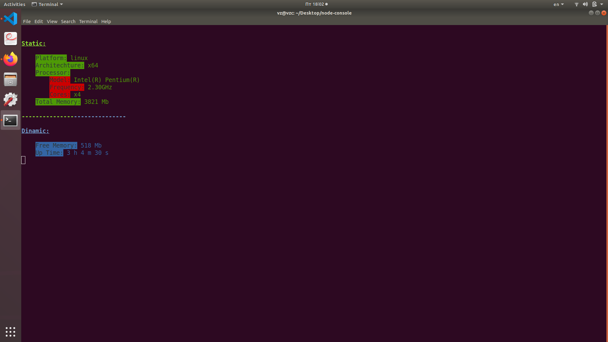

<h1>SYSMON - SYSTEM MONITOR ON NODE.JS</h1>

This console app shows the parameters of your system.

This app works with arguments. The argument functions are described in the help section. Run this app using --help to see this.

<h2>Arguments:</h2> 
<pre>    --update X     --    Update mode, where X is the time in ms.</pre>
<pre>    --no-update    --    Without updating.</pre>

</img>